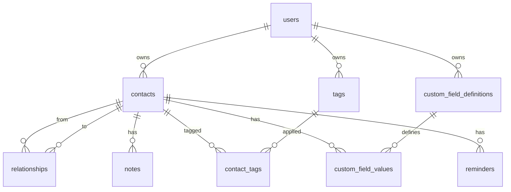

# Personal CRM — Self-Hostable Relationship Manager

A self-hostable personal CRM focused on people and relationships (not sales pipelines). Inspired by Monica, Clay, and Dex.

## Tech Stack

| Layer | Choice | Rationale |
|-------|--------|-----------|
| **Backend** | Node.js + TypeScript + Express | Mainstream, large ecosystem, easy Docker builds |
| **Database** | PostgreSQL 16 | JSONB for custom fields, full-text search, mature |
| **ORM / Migrations** | Knex.js | Lightweight, SQL-first, clean migrations |
| **Auth** | JWT (access + refresh tokens), bcrypt | Simple, stateless, single-user friendly |
| **Frontend** | React 18 + TypeScript + Vite | Fast dev server, excellent tooling |
| **Styling** | Vanilla CSS with CSS custom properties | No framework lock-in, full control |
| **Graph Viz** | D3.js force-directed graph | Industry-standard, fully customizable |
| **Containerization** | Docker multi-stage + docker-compose | Simple self-hosting |

---

## Architecture Overview

```
┌────────────────────────────────────────────────────────┐
│                    Reverse Proxy                       │
│               (Nginx / Traefik / Caddy)                │
├────────────────────┬───────────────────────────────────┤
│   Frontend (SPA)   │         Backend API               │
│   React + Vite     │   Express + TypeScript            │
│   Port 5173 (dev)  │   Port 3001                       │
│   nginx :80 (prod) │                                   │
├────────────────────┴───────────────────────────────────┤
│                   PostgreSQL 16                        │
│                   Port 5432                            │
└────────────────────────────────────────────────────────┘
```

**Module boundaries:**
- `server/` — Express app: routes → controllers → services → repositories → Knex
- `client/` — React SPA: pages → components → hooks → api client
- `docker/` — Dockerfiles and compose
- Root: shared configs, `.env.example`, `README.md`

---

## Database Schema (SQL DDL)

### Entity-Relationship Summary



### Core Tables

```sql
-- Users (single-user friendly, but multi-user ready)
CREATE TABLE users (
    id            UUID PRIMARY KEY DEFAULT gen_random_uuid(),
    email         VARCHAR(255) UNIQUE NOT NULL,
    password_hash VARCHAR(255) NOT NULL,
    display_name  VARCHAR(255),
    created_at    TIMESTAMPTZ DEFAULT now(),
    updated_at    TIMESTAMPTZ DEFAULT now()
);

-- Contacts
CREATE TABLE contacts (
    id            UUID PRIMARY KEY DEFAULT gen_random_uuid(),
    user_id       UUID NOT NULL REFERENCES users(id) ON DELETE CASCADE,
    first_name    VARCHAR(255) NOT NULL,
    last_name     VARCHAR(255),
    avatar_url    TEXT,
    company       VARCHAR(255),
    job_title     VARCHAR(255),
    birthday      DATE,
    emails        JSONB DEFAULT '[]',    -- [{value, label, primary}]
    phones        JSONB DEFAULT '[]',    -- [{value, label, primary}]
    addresses     JSONB DEFAULT '[]',    -- [{street, city, state, zip, country, label}]
    social_links  JSONB DEFAULT '{}',    -- {linkedin, twitter, website, ...}
    is_archived   BOOLEAN DEFAULT false,
    last_contacted_at TIMESTAMPTZ,
    created_at    TIMESTAMPTZ DEFAULT now(),
    updated_at    TIMESTAMPTZ DEFAULT now()
);
CREATE INDEX idx_contacts_user ON contacts(user_id);
CREATE INDEX idx_contacts_name ON contacts(user_id, first_name, last_name);

-- Relationship type enum
CREATE TYPE relationship_type AS ENUM (
    'friend', 'colleague', 'parent', 'child', 'sibling', 'cousin',
    'partner', 'spouse', 'mentor', 'mentee', 'manager', 'report',
    'introduced_by', 'met_at_event', 'acquaintance', 'neighbor', 'other'
);

-- Relationships (directed graph edges)
CREATE TABLE relationships (
    id              UUID PRIMARY KEY DEFAULT gen_random_uuid(),
    user_id         UUID NOT NULL REFERENCES users(id) ON DELETE CASCADE,
    from_contact_id UUID NOT NULL REFERENCES contacts(id) ON DELETE CASCADE,
    to_contact_id   UUID NOT NULL REFERENCES contacts(id) ON DELETE CASCADE,
    type            relationship_type NOT NULL,
    metadata        JSONB DEFAULT '{}',
    created_at      TIMESTAMPTZ DEFAULT now(),
    CONSTRAINT chk_no_self_ref CHECK (from_contact_id <> to_contact_id)
);
CREATE INDEX idx_rel_from ON relationships(from_contact_id);
CREATE INDEX idx_rel_to   ON relationships(to_contact_id);

-- Notes
CREATE TABLE notes (
    id          UUID PRIMARY KEY DEFAULT gen_random_uuid(),
    contact_id  UUID NOT NULL REFERENCES contacts(id) ON DELETE CASCADE,
    user_id     UUID NOT NULL REFERENCES users(id) ON DELETE CASCADE,
    body        TEXT NOT NULL,
    format      VARCHAR(10) DEFAULT 'markdown',
    tags        JSONB DEFAULT '[]',
    created_at  TIMESTAMPTZ DEFAULT now(),
    updated_at  TIMESTAMPTZ DEFAULT now()
);
CREATE INDEX idx_notes_contact ON notes(contact_id);

-- Tags
CREATE TABLE tags (
    id        UUID PRIMARY KEY DEFAULT gen_random_uuid(),
    user_id   UUID NOT NULL REFERENCES users(id) ON DELETE CASCADE,
    name      VARCHAR(100) NOT NULL,
    color     VARCHAR(7) DEFAULT '#6366f1',
    UNIQUE(user_id, name)
);

-- Contact ↔ Tag join
CREATE TABLE contact_tags (
    contact_id UUID REFERENCES contacts(id) ON DELETE CASCADE,
    tag_id     UUID REFERENCES tags(id) ON DELETE CASCADE,
    PRIMARY KEY (contact_id, tag_id)
);

-- Custom Field Definitions (per user/workspace)
CREATE TABLE custom_field_definitions (
    id            UUID PRIMARY KEY DEFAULT gen_random_uuid(),
    user_id       UUID NOT NULL REFERENCES users(id) ON DELETE CASCADE,
    name          VARCHAR(255) NOT NULL,
    field_type    VARCHAR(20) NOT NULL,
    options       JSONB DEFAULT '[]',
    default_value TEXT,
    sort_order    INT DEFAULT 0,
    UNIQUE(user_id, name)
);

-- Custom Field Values (per contact)
CREATE TABLE custom_field_values (
    id          UUID PRIMARY KEY DEFAULT gen_random_uuid(),
    contact_id  UUID NOT NULL REFERENCES contacts(id) ON DELETE CASCADE,
    field_id    UUID NOT NULL REFERENCES custom_field_definitions(id) ON DELETE CASCADE,
    value       TEXT,
    UNIQUE(contact_id, field_id)
);

-- Reminders (v1.1 — keep-in-touch)
CREATE TABLE reminders (
    id            UUID PRIMARY KEY DEFAULT gen_random_uuid(),
    contact_id    UUID NOT NULL REFERENCES contacts(id) ON DELETE CASCADE,
    user_id       UUID NOT NULL REFERENCES users(id) ON DELETE CASCADE,
    type          VARCHAR(20) DEFAULT 'keep_in_touch',
    interval_days INT,
    due_date      DATE,
    note          TEXT,
    is_completed  BOOLEAN DEFAULT false,
    created_at    TIMESTAMPTZ DEFAULT now()
);
CREATE INDEX idx_reminders_due ON reminders(user_id, due_date);
```

---

## API Design (OpenAPI Summary)

Base path: `/api/v1`

| Method | Path | Description |
|--------|------|-------------|
| `POST` | `/auth/register` | Create account |
| `POST` | `/auth/login` | Login → JWT |
| `POST` | `/auth/refresh` | Refresh token |
| **Contacts** | | |
| `GET` | `/contacts` | List (paginated, filterable, searchable) |
| `POST` | `/contacts` | Create contact |
| `GET` | `/contacts/:id` | Get contact + custom fields + tags |
| `PUT` | `/contacts/:id` | Update contact |
| `DELETE` | `/contacts/:id` | Delete contact |
| `PATCH` | `/contacts/:id/archive` | Archive/unarchive |
| `GET` | `/contacts/:id/graph` | Get relationship graph (1-hop neighbors) |
| `GET` | `/contacts/:id/timeline` | Unified timeline (notes + reminders) |
| **Relationships** | | |
| `POST` | `/relationships` | Create relationship edge |
| `DELETE` | `/relationships/:id` | Delete edge |
| `GET` | `/relationships?contact_id=` | List edges for contact |
| **Notes** | | |
| `GET` | `/contacts/:id/notes` | List notes for contact |
| `POST` | `/contacts/:id/notes` | Create note |
| `PUT` | `/notes/:id` | Update note |
| `DELETE` | `/notes/:id` | Delete note |
| **Tags** | | |
| `GET` | `/tags` | List all tags |
| `POST` | `/tags` | Create tag |
| `PUT` | `/tags/:id` | Update tag |
| `DELETE` | `/tags/:id` | Delete tag |
| `POST` | `/contacts/:id/tags` | Assign tags to contact |
| `DELETE` | `/contacts/:id/tags/:tagId` | Remove tag |
| **Custom Fields** | | |
| `GET` | `/custom-fields` | List definitions |
| `POST` | `/custom-fields` | Create definition |
| `PUT` | `/custom-fields/:id` | Update definition |
| `DELETE` | `/custom-fields/:id` | Delete definition |
| **Reminders** | | |
| `GET` | `/reminders` | List upcoming reminders |
| `POST` | `/reminders` | Create reminder |
| `PUT` | `/reminders/:id` | Update |
| `DELETE` | `/reminders/:id` | Delete |
| **Search** | | |
| `GET` | `/search?q=` | Global full-text search (contacts + notes) |

A full OpenAPI YAML spec will be generated as `server/docs/openapi.yaml`.

---

## Frontend Component Tree & Routing

### Routing Map

| Path | Screen | Description |
|------|--------|-------------|
| `/login` | Login | Auth page |
| `/register` | Register | Signup page |
| `/` | Dashboard | Home: search, recent contacts, birthdays, activity |
| `/contacts` | ContactList | Table/card view with filters |
| `/contacts/:id` | ContactDetail | Detail view with tabs |
| `/contacts/:id/graph` | GraphView | Full-screen relationship graph |
| `/settings` | Settings | Tags, custom fields management |
| `/settings/tags` | TagsManager | CRUD tags |
| `/settings/fields` | FieldsManager | CRUD custom field definitions |

### Component Tree

```
App
├── AuthLayout
│   ├── LoginPage
│   └── RegisterPage
├── AppLayout
│   ├── Sidebar (collapsible on mobile)
│   │   ├── Logo + AppName
│   │   ├── SearchBox (global)
│   │   ├── NavLinks (Dashboard, Contacts, Settings)
│   │   └── UserMenu (logout)
│   ├── TopBar (mobile: hamburger + search)
│   └── MainContent
│       ├── DashboardPage
│       │   ├── SearchWidget
│       │   ├── RecentContacts
│       │   ├── UpcomingBirthdays
│       │   └── RecentActivity
│       ├── ContactListPage
│       │   ├── FilterBar (search, tags, sort)
│       │   ├── ContactCard / ContactRow
│       │   └── Pagination
│       ├── ContactDetailPage
│       │   ├── ContactHeader (avatar, name, role, company)
│       │   ├── QuickActions (add note, add relationship, set reminder)
│       │   └── TabPanel
│       │       ├── OverviewTab (details, custom fields, tags)
│       │       ├── TimelineTab (notes + reminders chronological)
│       │       └── GraphTab (embedded force-directed graph)
│       ├── SettingsPage
│       │   ├── TagsManager
│       │   └── FieldsManager
│       └── Shared
│           ├── Modal, Drawer
│           ├── Button, Input, Select, Badge
│           ├── Avatar, EmptyState
│           └── RelationshipGraph (D3 force-directed)
```

---

## Proposed Changes

### Backend (`server/`)

#### [NEW] [package.json](file:///Users/samir/personal-crm/server/package.json)
Express + TypeScript dependencies, scripts (`dev`, `build`, `migrate`, `seed`).

#### [NEW] [tsconfig.json](file:///Users/samir/personal-crm/server/tsconfig.json)
TypeScript config targeting ES2022 / Node.

#### [NEW] [src/index.ts](file:///Users/samir/personal-crm/server/src/index.ts)
Entry point: Express app setup, middleware (CORS, JSON, auth), route mounting.

#### [NEW] [src/config.ts](file:///Users/samir/personal-crm/server/src/config.ts)
Environment variable loading & validation.

#### [NEW] [src/db/knexfile.ts](file:///Users/samir/personal-crm/server/src/db/knexfile.ts)
Knex configuration for Postgres connection.

#### [NEW] [src/db/migrations/](file:///Users/samir/personal-crm/server/src/db/migrations/)
Migration files for all tables listed in schema above.

#### [NEW] [src/db/seeds/](file:///Users/samir/personal-crm/server/src/db/seeds/)
Seed file with a demo user and sample contacts.

#### [NEW] [src/middleware/auth.ts](file:///Users/samir/personal-crm/server/src/middleware/auth.ts)
JWT verification middleware.

#### [NEW] [src/routes/](file:///Users/samir/personal-crm/server/src/routes/)
Route files for `auth`, `contacts`, `relationships`, `notes`, `tags`, `customFields`, `reminders`, `search`.

#### [NEW] [src/controllers/](file:///Users/samir/personal-crm/server/src/controllers/)
Controller functions per resource (thin: parse request → call service → send response).

#### [NEW] [src/services/](file:///Users/samir/personal-crm/server/src/services/)
Business logic layer per resource.

#### [NEW] [src/types/](file:///Users/samir/personal-crm/server/src/types/)
TypeScript interfaces and Zod validation schemas.

#### [NEW] [docs/openapi.yaml](file:///Users/samir/personal-crm/server/docs/openapi.yaml)
Full OpenAPI 3.0 spec for the API.

---

### Frontend (`client/`)

#### [NEW] [package.json](file:///Users/samir/personal-crm/client/package.json)
React + Vite dependencies, scripts.

#### [NEW] [index.html](file:///Users/samir/personal-crm/client/index.html)
Vite entry HTML with SEO meta tags.

#### [NEW] [src/main.tsx](file:///Users/samir/personal-crm/client/src/main.tsx)
React entry point with BrowserRouter.

#### [NEW] [src/index.css](file:///Users/samir/personal-crm/client/src/index.css)
Global design system: CSS custom properties, typography (Inter via Google Fonts), color palette, dark mode ready.

#### [NEW] [src/App.tsx](file:///Users/samir/personal-crm/client/src/App.tsx)
Root component with routing.

#### [NEW] [src/api/](file:///Users/samir/personal-crm/client/src/api/)
API client functions (fetch wrapper with auth headers).

#### [NEW] [src/pages/](file:///Users/samir/personal-crm/client/src/pages/)
Page components: `Dashboard`, `ContactList`, `ContactDetail`, `Settings`, `Login`, `Register`.

#### [NEW] [src/components/](file:///Users/samir/personal-crm/client/src/components/)
Reusable UI: `Sidebar`, `TopBar`, `ContactCard`, `RelationshipGraph`, `Modal`, `Badge`, `Avatar`, form inputs.

#### [NEW] [src/hooks/](file:///Users/samir/personal-crm/client/src/hooks/)
Custom hooks: `useAuth`, `useContacts`, `useDebounce`, etc.

#### [NEW] [src/context/](file:///Users/samir/personal-crm/client/src/context/)
React context for auth state.

---

### Docker & DevOps (root)

#### [NEW] [docker-compose.yml](file:///Users/samir/personal-crm/docker-compose.yml)
Three services: `db` (Postgres 16), `api` (backend), `web` (frontend/nginx).

#### [NEW] [server/Dockerfile](file:///Users/samir/personal-crm/server/Dockerfile)
Multi-stage: build TypeScript → slim Node runtime.

#### [NEW] [client/Dockerfile](file:///Users/samir/personal-crm/client/Dockerfile)
Multi-stage: build Vite → nginx Alpine serving static files.

#### [NEW] [client/nginx.conf](file:///Users/samir/personal-crm/client/nginx.conf)
Nginx config with SPA fallback and API proxy.

#### [NEW] [.env.example](file:///Users/samir/personal-crm/.env.example)
All configurable settings documented.

#### [NEW] [README.md](file:///Users/samir/personal-crm/README.md)
Setup guide, quick start, architecture overview.

---

## Design & UX Highlights

- **Color palette:** Deep indigo/violet primary (`#6366f1`), warm neutrals, dark mode with rich grays
- **Typography:** Inter (Google Fonts) — clean, modern, excellent readability
- **Cards & glassmorphism:** Contact cards with subtle backdrop blur, smooth shadows
- **Micro-animations:** Hover lifts, button pulses, page transitions with CSS `@keyframes`
- **Responsive:** Collapsible sidebar → bottom nav on mobile, stacked layouts, 44px minimum tap targets
- **Graph viz:** D3 force-directed with zoom/pan, nodes colored by tag, edge labels for relationship types

---

## Verification Plan

### Automated Checks
1. **Backend compiles:** `cd server && npm run build` — TypeScript compilation succeeds
2. **Migrations run:** `cd server && npm run migrate` — All tables created in Postgres
3. **Frontend builds:** `cd client && npm run build` — Vite production build succeeds
4. **Docker compose:** `docker compose up --build` — All 3 containers start healthy

### Browser Verification
5. Open `http://localhost:5173` (dev) — frontend renders login page
6. Register a user → redirected to dashboard
7. Create a contact → appears in contact list
8. Add a relationship → appears in graph tab
9. Responsive check: resize browser to mobile width → sidebar collapses

### Manual (User) Verification
10. After scaffold is complete, the user reviews the code structure, confirms it meets requirements, and tries Docker compose locally
